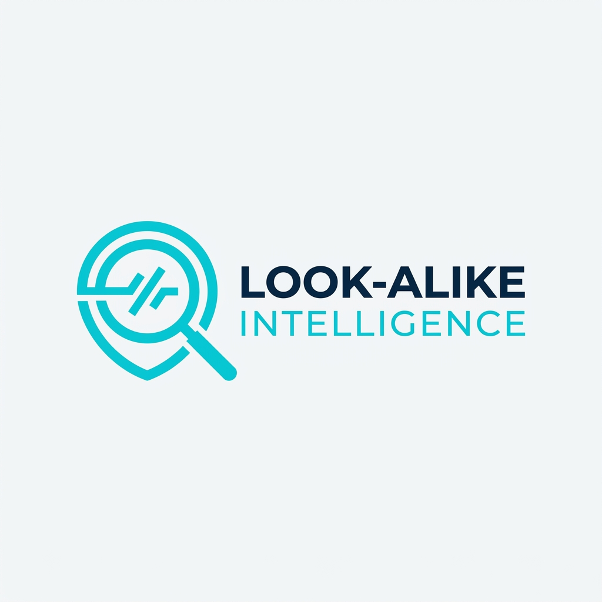

<p align="center">
  
</p>

<h1 align="center">Look-Alike Intelligence</h1>

<p align="center">
  <strong>Identify and analyze application look-alikes and brand impersonations across multiple stores.</strong>
</p>

<p align="center">
  
  
  
  
  
  
</p>

---

## 🌟 Overview

**Look-Alike Intelligence** is a cutting-edge platform designed for brand protection and user safety. It proactively scans global application stores to detect potential impersonations, phishing apps, and brand-infringing software using advanced similarity algorithms.

### Supported Stores
- 🍏 **Apple App Store**
- 🤖 **Google Play Store**
- 📦 **APKPure**
- 🅰️ **Aptoide**
- 📱 **Huawei AppGallery**

---

## ✨ Features

- **Multi-Store Intelligence**: Centralized monitoring across 5+ global app stores.
- **Similarity Scoring**: Uses `RapidFuzz` for high-performance fuzzy string matching and brand name similarity analysis.
- **Automated Scraping**: Integrated with `Playwright` and `Google Play Scraper` for real-time data retrieval.
- **Risk Assessment**: Automated calculation of threat levels for detected look-alikes.
- **Modern Dashboard**: High-performance UI built with **Next.js 15+** and **Tailwind CSS v4**.

---

## 📸 Preview

<p align="center">
  
  <br>
  <em>Next-generation Threat Intelligence Dashboard</em>
</p>

<br>

<table align="center">
  <tr>
    <td align="center" width="50%">
      
      <br>
      <strong>Detailed Application Analysis</strong>
    </td>
    <td align="center" width="50%">
      
      <br>
      <strong>Look-alike Risk Assessment</strong>
    </td>
  </tr>
</table>


---

## 🛠️ Tech Stack

### Backend (Intelligence API)
- **Framework**: FastAPI
- **Automation**: Playwright (Headless Scraping)
- **Logic**: RapidFuzz (String Similarity)
- **Network**: HTTPX & Requests

### Frontend (Security Dashboard)
- **Framework**: Next.js 15+ (App Router)
- **Styling**: Tailwind CSS v4 & Shadcn UI
- **Icons**: Lucide React
- **Language**: TypeScript

---

## 🚀 Getting Started

### 🐳 Run with Docker (Recommended)

1. **Spin up the environment**:
   ```bash
   docker compose up --build
   ```
2. **Stop the environment**:
   ```bash
   docker compose down
   ```

### 🐍 Run Locally (Development)

#### Backend
```bash
cd Backend
pip install -r requirements.txt
python main.py
```

#### Frontend
```bash
cd Frontend/look-alike
pnpm install
pnpm dev
```

---

## 📂 Project Structure

```text
.
├── Backend/               # FastAPI Intelligence API
│   ├── controllers/       # Route handlers
│   ├── schemas/           # Data models (Pydantic)
│   ├── services/          # Core business logic & Scraping
│   └── main.py            # Entry point
├── Frontend/              # Next.js Web Application
│   ├── app/               # App Router, Pages & Layouts
│   ├── components/        # UI Components (Shadcn)
│   └── lib/               # Utility functions & Axios config
├── assets/                # README images and icons
└── docker-compose.yml     # Container orchestration
```

---

<p align="center">
  Built with ❤️ for Application Security
</p>